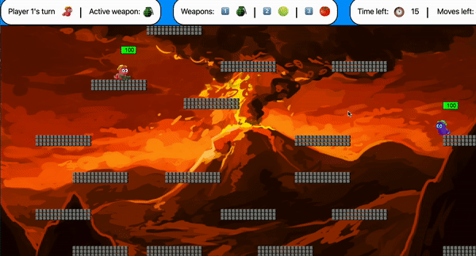
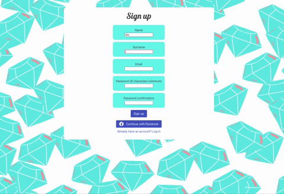
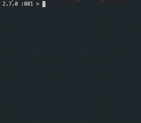
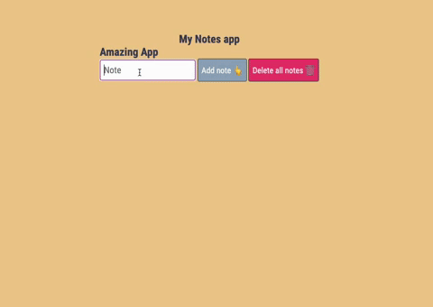
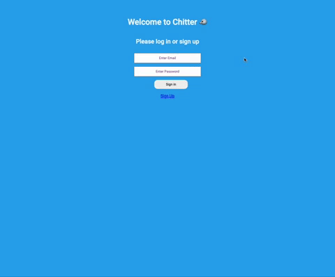
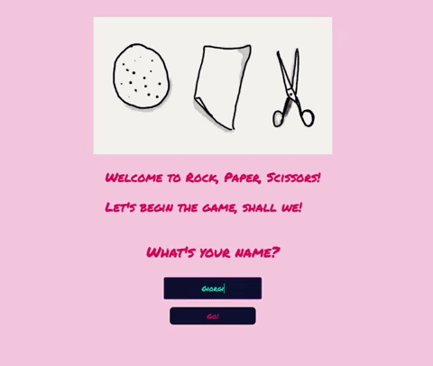

# CV
[Projects](#projects) | [Technical Experience](#technical-experience) | [Skills](#skills) | [Education](#education) | [Professional Experience](#professional-experience) | [Hobbies and Interests](#hobbies-and-interests) | [LinkedIn](https://www.linkedin.com/in/giorgigutsaev/)

## Giorgi Gutsaev

I am an aspiring Junior Developer, who is always hungry to expand my programming skills and conquer new realms of technology! Being an immensely curious individual, I like to go into solving problems with my eyes fully open, and translate my innate passion for this captivating industry into a clean, tested and reusable code. 

I studied at Makers Academy from November 2021 to February 2022, where I learnt the core principles of creating full-Stack web applications using JavaScript and Ruby. Also, my experience at Makers has taught me to always follow best working practices and effectively collaborate with others. I have documented my learning journey @Makers, so if you are interested what my life was like during those 12-weeks of bootcamp, please feel free to click [here](https://github.com/giorgigutsaevi/Makers-Learning-Portfolio). 

I have a BSc in Hospitality & Business Management, and a background in marketing & events, experience which made me a highly effective team-player and a communicator, that positively translates into impactful problem solving. During my time at Makers, I got enchanted by coding, and I am excited to bring my passion, enthusiasm to a new role, where I can both improve, learn and diversify my skillset. 

## Projects

This is a selection of projects that I have worked on. To see more,  [please see my Github](https://github.com/giorgigutsaevi?tab=repositoriess).

| Project | Description |
| -- | :--: |
| **Wormz**    A two-week final project at Makers. We as a team, decided to create a nostalgic 2D browser game. The aim of the project was to learn something completely new and really push ourselves, given a time constraint of 14 days.    **Tech Stack**   Node.js, JavaScript, p5.js,   Matter.js, Express    **Testing Frameworks**   Mocha  Chai | **[Wormz Repo](https://github.com/giorgigutsaevi/wormz)**   [Play Wormz on Heroku](https://wormz.herokuapp.com/)     |
| **Acebook**   The aim of the project was to create a facebook clone. The app is made by team Ruby Junkies. Users can sign up, log in, sign out, create posts, upload images, befriend users, and create their own unique profiles.    **Tech Stack**   Ruby on Rails, JavaScript, OAuth,  Devise, CSS     **Testing Frameworks**   Rspec  | **[Acebook Repo](https://github.com/giorgigutsaevi/acebook-ruby-junkies)**   [Acebook - Live](http://gem-junkies.herokuapp.com/)     |
| **News App**     I challenged myself to build a news-summary web app, using Guardian's API. API returns 10 latest news headlines as a JSON, which then gets processed and rendered out    **Tech Stack**   JavaScript, Axios, HTML, CSS     **Testing Frameworks**   Jest   | **[News App Repo](https://github.com/giorgigutsaevi/news-summary-challenge)**     |
| **Banking**    A CLI-based Ruby application allowing you to create a bank account, make deposits, withdraw money and print statements. The aim of this project was to focus fully on OOD and the TDD process with writing clean, DRY code.    **Tech Stack**   Ruby    **Testing Frameworks**   RSpec   | **[Bank Repo](https://github.com/giorgigutsaevi/bank-tech-test)**     |
| **Notes App**    a simple Notes App, that is essentially a SPA allowing users to add a to-do and delete them all. There is also a mock server created with Express.js that stores all added to-dos.    **Tech Stack**   Node.js, Express, es-build    **Testing Frameworks**   Jest   | **[Notes Repo](https://github.com/giorgigutsaevi/JS-notes-app)**     |
| **Chitter**     A Twitter Clone, where users can sign up, sign in and share their peeps with the rest of the world.    **Tech Stack**   Ruby, Sinatra, PostgreSQL, CSS    **Testing Frameworks**   RSpec   | **[Chitter App Repo](https://github.com/giorgigutsaevi/chitter-challenge)**     |
| **Rock, Paper, Scissor**s    A Ruby/Sinatra web game.   The player can enter their name and play 'Rock, Paper, Scissors' against the computer. The game tracks the game score so the player can see how successful they are.    **Tech Stack**   Ruby, Sinatra, CSS, HTML    **Testing Frameworks**   RSpec   | **[Rock, Paper, Scissors Repo](https://github.com/giorgigutsaevi/rps-challenge)**     |

## Technical Experience

#### Makers Academy (Nov 2021 to Feb 2022)

- JavaScript (currently learning React)
- Node
- Ruby 
- Rails
- Full Stack Web Development
- OOP, TDD, MVC
- Agile methodologies
- Version Control (Git/Github)
- Jest, RSpec, Mocha/Chai
- Deploying on Heroku
- HTML, CSS (Bootstrap, Bulma)
- Configuring APIs (Twilio/Guardian)
- Majority of projects were paired/team. Some individual work with strong focus on processes and TDD.

## Skills

#### Initiative

- I am a huge advocate for effective communication. During my time at VTB Bank Georgia, I suggested to introduce a chat-based communication (Microsoft Teams) to avoid mass email traffic within the organisation, which eventually increased day-to-day productivity. Also, frequently during Pair programming at Makers, I would be vocal about our current or future objectives, hence defusing the tension. 
- I am a naturally curious person, constantly hungry to learn more about the world, research novelties and new technologies in the tech industry. I frequently listen to podcasts about a variety of topics, including tech, science, and history. 
- I am currently learning React, Redux & MongoDB with the overall aim to master the MERN stack. 

#### Problem Solving

I enjoy solving problems with a systematic and divide-and-conquer approach, which stems from my previous professional roles. When tackling any problem, especially code related, I like to deconstruct the problem, divide it into smaller chunks and try to write it down on a piece paper. This helps me visualise what needs to be done, especially since I am a visual learner. For example, during the Acebook challenge (essentially creating a Facebook clone), another pair asked me if I could help them to solve an issue they were having with a feature that allows the users to see how many people liked a certain post. Even though the project was primarily written in Ruby on Rails, I guided them to use JavaScript and explained several CSS magic tricks to solve the issue.

#### Ability to perform under pressure
In my former role as an events coordinator at Active Communications International, I was often tasked to manage and oversee the planning and execution of three or more simultaneous events, frequently being scheduled in different time-zones. Despite the immense pressure, I was able to thrive under such circumstances and was able to deliver exceptional results, with clients often times buying the tickets on spot for the next year's iteration of the same event/conference. 

#### Professional

- Managed 45+ B2B events internationally across various industries
- Managed the development of a multimedia tourism platform
- Implemented a lifestyle program that rewarded customers with entertainment discounts and facilitated 220% jump in loyalty among existing customers 
- Managed marketing campaigns from inception, client requirements, planning, through to implementation and delivery
- Commissioned and managed market research on customer loyalty & customer satisfaction (Increased trust 
 towards the bank by 19%)
- Managed Social Media Channels and inter-organisational communication
- Implemented five nation-wide sponsorship projects

## Education

#### Les Roches-Gruyere, University of Applied Sciences (Sep 2009 to Aug 2013) 

- Hospitality Management and Business Administration
- Student Ambassador

## Professional Experience

**Active Communications International** (Jan 2019 - Feb 2021)    
*Marketing & Event Operations Coordinator*  
- Managed 45+ B2B events internationnally per year across various industries.
- Sourced, appointed, liaised, and managed venues, event contractors and suppliers.
- Controlled the costs for each event, regularly updating a running financial forecast.
- Created promotional content such as: newsletters, brochures, and documentation packages for each event.

**Georgian Tourism Board** (June 2018 - Jan 2019)    
*Marketing & Branding Executive*  
- Developed and monitored marketing campaigns to position Georgia as a popular all-season destination. 
- Organised travel exhibitions across Europe, North America, and Asia.
- Led and monitored both BTL & ATL marketing campaigns on CNN, BBC, Euronews, and National Geographic, resulting in increased inbound tourist traffic by 12% in the 3rd quarter of 2018.
- Oversaw the creation of Georgia.Travel - a multimedia tourism platform.
- Worked closely with product team to scope and brief suggestions on platform improvements/suggestions.

**VTB Bank Georgia** (Jan 2016 - June 2018)  
*Marketing Coordinator*
- Managed five nation-wide sponsorship projects
- Implemented promotional marketing campaigns for various banking products
- Managed Social Media channels and the internal communications platform (Intranet)

## Hobbies and Interests

- I love gaming, especially 4x turn-based ones, currently playing Civ 6 and Crusader Kings III!
- I enjoy a number of different sports: football, rugby, snooker.
- I love trying different foods of the world and learning about their culture.
- I love reading, recently got really into modern science fiction and world war II history. 
- Thoroughly enjoy listening to podcasts: How I Built This, Dan Carlin's Hardcore History, Revisionist History, Stuff You Should Know. 
